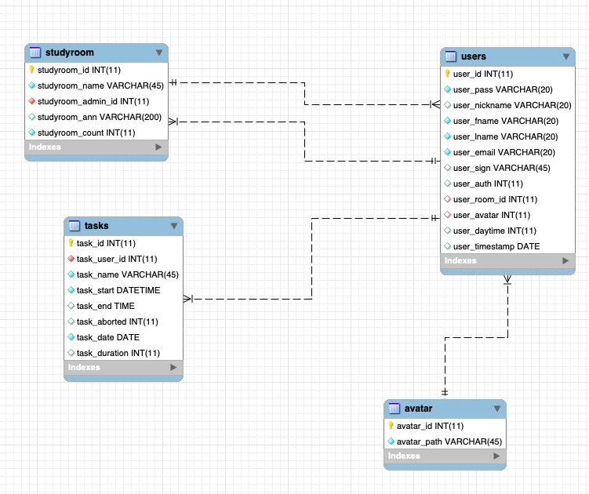

#  ##
*An online group study platform, devoted for people to better manage time during the Coronavirus Pandemic.*

*Create an account and try the StudyRoom now at http://303.itpwebdev.com/~haomeili/final_project/login.php*

*The website is created for ITP303 as the final project.*

### Overview ###
- Philosophy
    - Common people are all potential procrastinators. In the special time of quarantine, many people find it difficult to manage their time wisely. We believe that an external force, like pressure and competition, can help people to better focus.
- Functionalities
    - Create, log in, log out an account
    - Quick view of focus time, rank, and finished items
    - Join, exit, view info, see members’ rank of a study room
    - Start a focus session, timer
    - View statistics of focus time

### Front End ###
- HTML, CSS
- Bootstrap

### Back End ###
- php, sql
- 

### To Be Improved ###
- Statistics
- More organized UI
- CRUD for study rooms

### Credit ###
- The website references the following designs from CodePen:
    - NavBar references work of [Morten Sørensen](https://moso.io)
    - [Stats display](https://codepen.io/themustafaomar/pen/jLMPKm) 
    - Pure CSS pie timer by [Hugo Giraudel](https://codepen.io/HugoGiraudel/pen/BHEwo)
- Images
    - Home Picture from [Shubham Yadav](https://dribbble.com/shots/5445213-Study-Illustration) on dribbble
    - Unsplash
        - Photo by Bucography
        - Photo by Wes Hicks
        - Photo by Michael Dolejš 
        - Photo by Akson 
